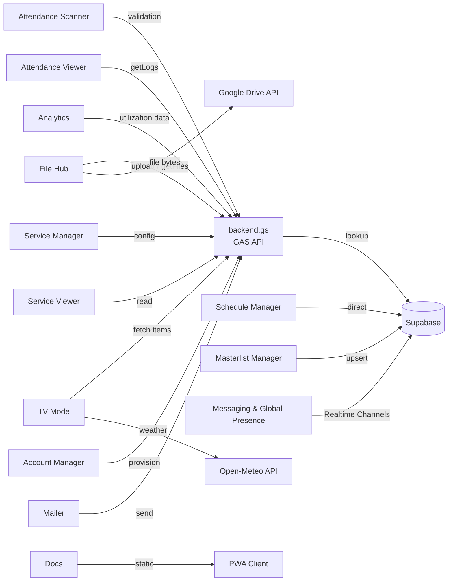
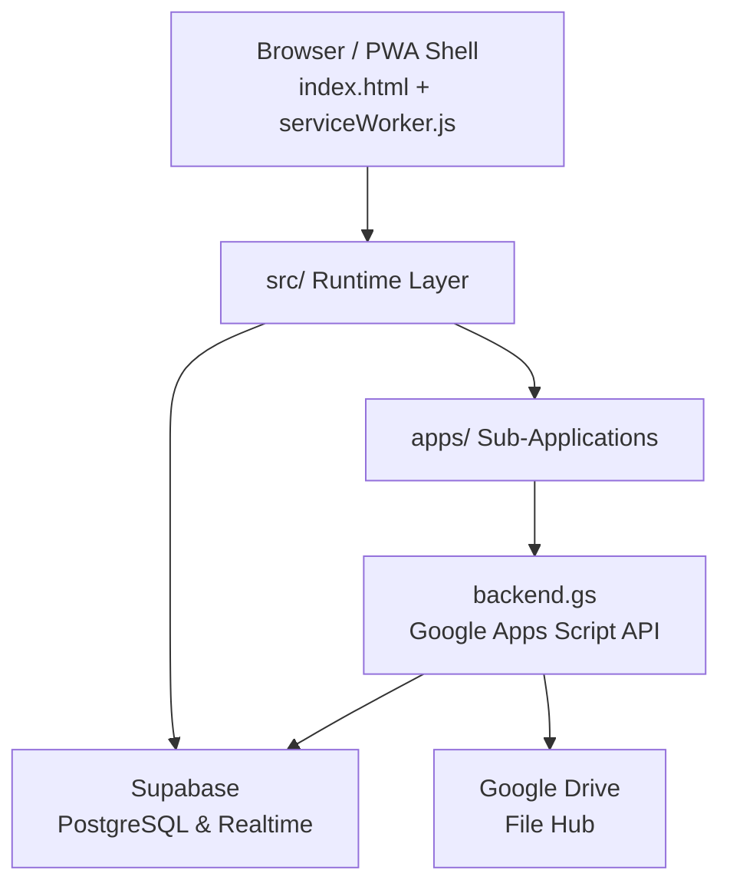

# SAS Portal

The **Student Affairs and Services (SAS) Portal** is the centralized web application used by Northern Bukidnon State College. It provides a single unified interface for managing student data, attendance, scheduling, file distribution, and messaging. 

The portal is designed for administrative staff, but it also features a dedicated TV Display Mode for broadcasting announcements on campus televisions.

---

## Included Modules

The portal consists of several integrated applications located in the `apps/` directory:

- **Account Manager:** Provisions user accounts and manages administrative roles.
- **Analytics:** Generates utilization reports and visual analytics for SAS services.
- **Attendance Scanner:** A mobile-friendly PWA for entrance points to scan student IDs.
- **Attendance Viewer:** An interface for staff to browse, search, and export attendance logs.
- **Docs:** Centralized documentation and user guides for the system.
- **File Hub:** A document management system integrating with Google Drive and Firebase Storage.
- **Mailer:** A tool for composing and sending administrative emails.
- **Masterlist Manager:** Handles bulk imports (CSV, JSON, PDF) to update the student database.
- **Schedule Manager:** Configures the active "check-in windows" used by the Attendance Scanner.
- **Service Manager:** Configures and administers various SAS services.
- **Service Viewer:** Provides a read-only view of active services and their status.

### Module Dependency Map



## System Architecture

The project is structured as a client-side web application supported by centralized APIs.



### Technology Stack
- **Frontend Core:** HTML5, CSS (Vanilla), JavaScript
- **Offline Support:** Progressive Web App (PWA) with Service Worker caching
- **Backend API:** Google Apps Script (`backend.gs`) acting as the REST API
- **Database:** Supabase (PostgreSQL) for student records, schedules, and attendance logs
- **Real-time Services:** Supabase Realtime for global messaging, presence tracking, and system-wide broadcasts
- **File Storage:** Google Drive
- **Hosting:** Configured for automated CI/CD deployment via GitHub Actions (Trivy Security Scans, Obfuscation, and FTP publishing)

## Security & Routing
- **URL Route Guards:** Protected client-side routing intercepts unauthorized access and legacy domain requests, safely redirecting traffic.
- **XSS Prevention:** Strict `escapeHtml()` sanitization prevents DOM injection attacks.
- **Dynamic Secrets:** Production API keys are managed by GitHub Secrets and injected dynamically at build-time.

## Codebase Statistics

Based on the latest GitNexus index scan (May 2026):
- **Symbols/Nodes:** 3,196 tracked components
- **Relationships:** 4,703 edges
- **Functional Clusters:** 112
- **Execution Flows:** 199 traced workflows

## Repository Structure

```text
Centralized_SAS_repository/
├── index.html                  # Main portal shell, TV mode, and navigation host
├── styles.css                  # Global design system and layout styles
├── manifest.webmanifest        # PWA configuration
├── serviceWorker.js            # Offline caching logic
├── systems.json                # Defines the routing and URLs for all modules
├── env.example.js              # Environment variables template
├── backend.gs                  # Google Apps Script API source
│
├── src/                        # Shared runtime scripts
│   ├── main.js                 # Bootstraps authentication and UI
│   ├── core/                   # Firebase and session management
│   ├── features/               # TV clock and Messaging logic
│   └── utils/                  # Cross-frame communication bridges
│
└── apps/                       # Individual sub-applications
    ├── account-manager/
    ├── analytics/
    ├── attendance-scanner/
    ├── attendance-viewer/
    ├── docs/
    ├── file-hub/
    ├── mailer/
    ├── masterlist-manager/
    ├── schedule-manager/
    ├── service-manager/
    └── service-viewer/
```

## Setup & Configuration

1. **Environment Variables:** 
   Copy `env.example.js` to `env.js` and fill in the required keys (`BACKEND_GAS_URL`, `SUPABASE_URL`, `SUPABASE_ANON_KEY`, etc.).
2. **Local Development:**
   Run the setup script to initialize the environment:
   ```bash
   node scripts/dev-setup.js
   ```
   Start your preferred local server (e.g., `npx serve`) in the repository root.
3. **Diagnostics:**
   To verify that the backend API and database connections are working:
   ```bash
   node scripts/ci-connection-check.js
   ```
