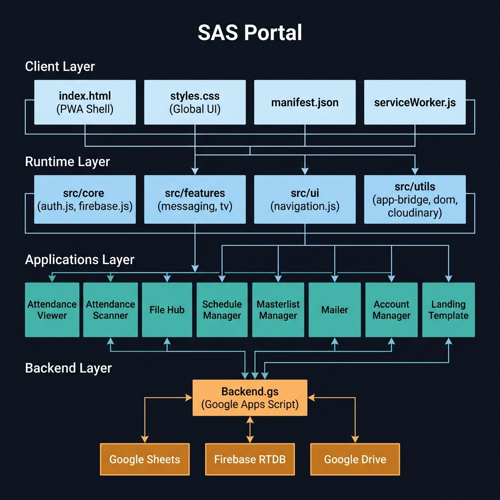
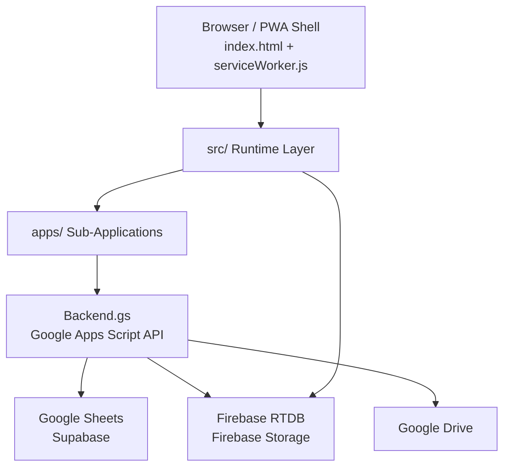
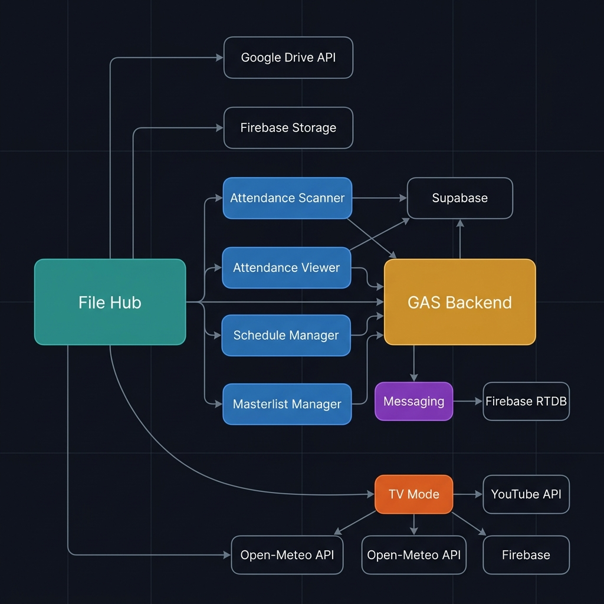
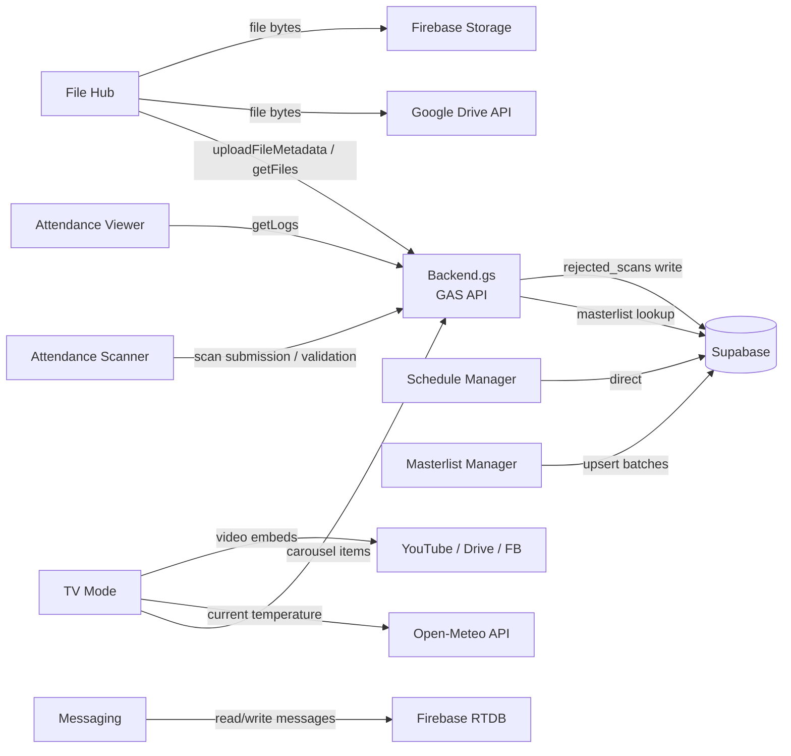

# SAS Portal — Centralized Repository

The **SAS Portal** is a centralized gateway that unifies access to the entire ecosystem of SAS systems. It is a secure and interactive hub where student data management, attendance tracking, scheduling, file management, messaging, and real-time announcements operate from a single deployable codebase.

Designed for dual-environment operation: an administrative dashboard for staff and a full-screen immersive display for 1080p common-area televisions.

---

## Table of Contents

- [System Architecture](#system-architecture)
- [Repository Structure](#repository-structure)
- [Feature Documentation](#feature-documentation)
  - [TV Immersive View](#tv-immersive-view)
  - [File Hub](#file-hub)
  - [Attendance Scanner](#attendance-scanner)
  - [Attendance Viewer](#attendance-viewer)
  - [Schedule Manager](#schedule-manager)
  - [Masterlist Manager](#masterlist-manager)
  - [Messaging](#messaging)
  - [PWA and Offline Support](#pwa-and-offline-support)
- [Module Dependency Map](#module-dependency-map)
- [Codebase Composition](#codebase-composition)
- [Technology Stack](#technology-stack)
- [Configuration Reference](#configuration-reference)
- [Developer Scripts](#developer-scripts)

---

## System Architecture



The portal follows a strict four-layer architecture. The **Client Layer** handles the PWA shell, global styles, and offline manifest. The **Runtime Layer** (`src/`) provides shared services — authentication, Firebase initialization, navigation, messaging, and TV features — consumed across the portal. The **Applications Layer** (`apps/`) contains eight self-contained sub-applications embedded inside the portal as iFrames. The **Backend Layer** is a single Google Apps Script deployment (`Backend.gs`) that serves as the centralized REST API, connecting to Google Sheets, Firebase, and Google Drive.



---

## Repository Structure

```
Centralized_SAS_repository/
│
├── index.html                  # Portal shell — navigation, iFrame host, TV mode, messaging widget
├── styles.css                  # Global stylesheet (~125 KB, covers all portal UI states)
├── manifest.json               # PWA manifest — icons, display mode, theme color
├── serviceWorker.js            # Three-strategy caching: app shell, GAS data, media CDN
├── systems.json                # Navigation configuration — defines portal modules and their URLs
├── version.json                # Build version used by service worker for cache invalidation
├── vercel.json                 # URL rewrite rules for Vercel deployment
├── env.js                      # Runtime environment variables (API keys, Firebase config)
├── env.example.js              # Template — copy and fill before running locally
├── Backend.gs                  # Google Apps Script backend — centralized API for all modules
│
├── src/                        # Shared runtime loaded by the portal shell
│   ├── main.js                 # Bootstrap — initializes auth, Firebase, and UI
│   ├── legacy.js               # Monolithic feature code undergoing modularization
│   ├── core/
│   │   ├── auth.js             # Session management, username resolution
│   │   └── firebase.js         # Firebase app initialization and db export
│   ├── features/
│   │   ├── messaging/
│   │   │   ├── logic.js        # Firebase RTDB listeners, read tracking, unread sync
│   │   │   ├── state.js        # Shared contacts map and messaging state
│   │   │   └── ui.js           # Badge rendering, notification popups, contact list
│   │   └── tv/
│   │       └── clock.js        # Animated digit counter clock + Open-Meteo weather fetch
│   ├── ui/
│   │   └── navigation.js       # Renders nav from systems.json, handles active state
│   └── utils/
│       ├── app-bridge.js       # PostMessage bridge for cross-frame portal communication
│       ├── cloudinary.js       # Cloudinary URL construction utilities
│       └── dom.js              # Lightweight getElementById wrapper (getEl)
│
├── apps/                       # Self-contained sub-applications (each has own index.html)
│   ├── attendance-viewer/      # Log browsing, filtering, export
│   ├── attendance-scanner/     # Student scan PWA with GAS API sync
│   ├── file-hub/               # File management — Drive, Firebase, legacy, draft support
│   ├── schedule-manager/       # Check-in window CRUD and calendar display
│   ├── masterlist-manager/     # Bulk student record import (CSV / JSON / PDF)
│   ├── mailer/                 # Administrative email composition
│   ├── account-manager/        # User provisioning and role management
│   └── landing-template/       # Reusable base template for new sub-application UIs
│
├── scripts/                    # CI and developer utilities
│   ├── ci-connection-check.js  # Validates GAS backend connectivity
│   ├── ci-syntax-check.js      # Static JS syntax validation
│   ├── dev-setup.js            # Local development initialization
│   ├── stress-test.js          # Backend API load testing
│   └── system-diagnostic.js    # End-to-end health check for all connected services
│
└── assets/                     # Static image and media assets
```

---

## Feature Documentation

### TV Immersive View

The TV Immersive View is a dedicated full-screen display mode optimized for 1080p television screens mounted in common areas. When activated, it transforms the portal interface into a broadcast-style dashboard.

**How it works:**

When TV mode is triggered, `document.body` receives the `tv-mode` class, which activates a separate CSS layout context designed for a 1920×1080 canvas. The interface shifts to show an animated live clock, a live weather widget, and the active announcement carousel — hiding the standard administrative navigation.

**Clock (src/features/tv/clock.js):**
The clock uses a custom `DigitCounter` class. Each digit (0–9) is pre-rendered as a vertical column of ten DOM elements. When the time changes, the column translates vertically using CSS `translateY` to scroll to the correct digit — producing a smooth mechanical counter animation without JavaScript-driven transitions. The digit height adjusts between 40px (TV mode) and 60px (normal mode) automatically by checking for the `tv-mode` body class.

**Weather:**
On initialization, a fetch is made to the [Open-Meteo API](https://open-meteo.com/) using hardcoded coordinates (lat: 8.3569, lon: 124.8622) to retrieve the current temperature and weather code. The result displays as a live temperature reading alongside the clock.

**Media Carousel:**
The carousel in TV mode supports four media source types:
- **YouTube** — embeds via `GetYouTubeVideoId`, auto-plays in loop mode
- **Facebook** — embeds via `GetFacebookVideoUrl`
- **Google Drive** — direct video embed via `GetDriveId`
- **Cloudinary** — CDN-delivered images and video

A polling loop (`StartYTPolling`) checks the GAS backend for active carousel items and cycles through them on a configurable interval. The ticker bar at the bottom of the screen streams announcements continuously from the same backend data source.

**Scaling:**
The portal uses a virtual 1920×1080 canvas scaled with CSS `transform: scale()` to fit any screen resolution while maintaining the exact pixel layout intended for TV display.

---

### File Hub

The File Hub is a personal and organizational file management system that allows authenticated users to upload, categorize, and share documents. It is the largest single module in the codebase at 45 symbols with 100% internal cohesion.

**How it works:**

The File Hub has three storage backend implementations that can be swapped via configuration:

| Implementation | File | Storage Target |
|---|---|---|
| Google Drive (primary) | `filehub_main.js` | Google Drive (OAuth2 via Google Identity Services) |
| Firebase Storage | `filehub_firebase.js` | Firebase Storage bucket |
| Legacy | `filehub_legacy.js` | Previous storage scheme |
| Draft system | `filehub_draft.js` | Firebase drafts before final upload |

**Google Drive flow (filehub_main.js):**
1. The user authenticates via Google Identity Services (GIS OAuth2). The access token is cached in `localStorage` with a 1-hour expiry to avoid repeated auth prompts.
2. On first use, the app searches the user's Drive for a folder named `SAS Portal Documents`. If not found, it creates one automatically.
3. File upload uses the Drive v3 multipart upload API — file bytes and JSON metadata are sent in a single request to `googleapis.com/upload/drive/v3/files`.
4. If the file is marked **Public**, a Drive permission is set (`role: reader, type: anyone`).
5. The file's Drive ID, URL, category, and privacy status are then registered in the GAS backend (`action: uploadFileMetadata`) which persists the metadata to Supabase.

**Firebase Storage flow (filehub_firebase.js):**
1. No OAuth prompt required — the user is identified via a `portalUser` URL parameter passed by the portal's iFrame URL.
2. Files are uploaded directly to Firebase Storage under the path `file-hub/{username}/{timestamp}_{filename}`.
3. The download URL is retrieved from Firebase and the same GAS metadata registration call is made.

**File listing and filtering:**
All files are loaded via `action: getFiles` from the GAS backend, which queries Supabase and returns a list of records. Client-side filtering by category applies without any additional network calls. Each file card displays the name, upload date, category tag, and a Public/Private status indicator.

---

### Attendance Scanner

The Attendance Scanner is a Progressive Web App designed to run on a mobile device or dedicated tablet at an entrance point. Students scan their ID or enter their student number, and the scan is recorded in real time via the centralized GAS API.

**How it works:**

The scanner does not communicate directly with Supabase. All scan submissions are routed through `Backend.gs`, which performs the following server-side logic:
1. **Identity validation** — the submitted student ID is cross-referenced against the `NBSC_masterlist` table in Supabase. If a match is found, the student record is returned.
2. **Duplicate check** — the backend checks whether the student has already scanned within the active schedule window.
3. **Unknown student handling** — if the ID does not match any record in the masterlist, the scan is NOT discarded. Instead, it is written to the `rejected_scans` table with the raw ID and timestamp, allowing administrators to review and resolve unmatched scans.
4. **Schedule enforcement** — the backend checks the `sas_schedules` table for an active window. Scans outside a defined window are rejected with an appropriate message.

The scanner app is installable as a PWA (has its own `manifest.json` and `sw.js`) and works offline with cached fallback responses.

---

### Attendance Viewer

The Attendance Viewer provides a read interface for staff to browse, filter, search, and export attendance logs.

**How it works:**

On load, the app fetches attendance records from the GAS backend (`action: getLogs` or similar), which queries the appropriate Supabase table. Records are displayed in a filterable table that supports:
- Date range filtering
- Name and ID search
- Status filtering (Present, Late, Unknown)
- Export to CSV

The viewer is read-only and does not mutate any backend data. Its execution flows (`FetchEvents → RenderTable`, `Init → BuildHeaders`) are entirely intra-community, meaning all logic is self-contained with no cross-module dependencies at runtime.

---

### Schedule Manager

The Schedule Manager allows administrators to define "check-in windows" — time-bounded periods during which the Attendance Scanner accepts scans.

**How it works:**

The app connects directly to Supabase via the Supabase JS client (`supabaseClient`) initialized with credentials from `window.ENV`. Each schedule record in the `sas_schedules` table contains:

| Field | Description |
|---|---|
| `label` | Human-readable name for the window (e.g., "Morning Check-in") |
| `date` | The calendar date of the window |
| `event_id` | Reference to a related event |
| `start_time` | Window open time |
| `end_time` | Window close time |
| `is_active` | Whether the scanner currently accepts scans for this window |

**Midnight crossing:** If the start time is later than the end time (e.g., 11:00 PM to 01:00 AM), the system prompts the administrator to confirm that a cross-midnight window is intended.

Each window card displays its date, label, and active/archived status. Administrators can toggle a window active or inactive without deleting it — preserving the historical record. Deletion of a window also deletes all associated attendance logs through a cascading confirmation prompt.

The Schedule Manager bypasses the service worker cache entirely — its requests always go to the network to ensure schedule changes are reflected immediately on the scanner.

---

### Masterlist Manager

The Masterlist Manager is the administrative tool for populating and updating the student identity database that the Attendance Scanner validates against.

**How it works:**

The app accepts student records in three file formats:

| Format | Parser | Notes |
|---|---|---|
| CSV | PapaParse | Headers auto-detected; supports `ID`, `Name`, `First Name`, `Last Name`, `Middle Name` |
| JSON | Native `JSON.parse` | Must be an array of objects |
| PDF | PDF.js | Text extraction by Y-coordinate grouping; parses lines matching the pattern `2021-0001 Lastname Firstname` |

**Pre-upload flow:**
1. File is parsed client-side. The app auto-sorts records alphabetically by last name before upload.
2. A preview table shows the first 5 rows with the detected column structure.
3. A **Test Mode / Production Mode** toggle determines whether data writes to `NBSC_masterlist_test` or the live `NBSC_masterlist` table. Production mode shows a red confirmation warning.

**Batch upload:**
To avoid Supabase payload limits, records are chunked into batches of 500 rows. Each batch is sent as an `upsert` operation (insert or update on conflict), preventing duplicate records if an upload is re-run. Only `ID` and `Name` columns are sent, regardless of how many columns appear in the source file — first/last/middle name columns are compiled into a standardized `Lastname, Firstname Middle` format automatically.

---

### Messaging

The Messaging system provides private, real-time direct messaging between portal users, accessible from a widget embedded in the portal header and from a full-screen messenger view.

**How it works:**

Messages are stored in Firebase Realtime Database under the `user_messages` node. Each message record contains `sender`, `receiver`, `content`, `timestamp`, and `read` (boolean).

**Listener architecture:**
The system registers two Firebase `onChildAdded` queries at initialization — one filtered by `receiver = myUsername` (incoming messages) and one by `sender = myUsername` (outgoing messages). Firebase RTDB does not support OR queries, so both listeners run in parallel. A deduplication check prevents the same message from being added to the local history twice.

**State management (state.js):**
All contact history and unread counts are stored in a shared `contactsMap` object keyed by the other user's username. This map persists in memory for the session and is the single source of truth for badge counts and chat history rendering.

**Read receipts:**
When a user opens a conversation, `markMessagesAsRead` writes `read: true` to every unread message in that thread via a batch Firebase `update()` call, clearing the unread badge immediately on the client.

**Background sync:**
A fallback `setInterval` runs every 5 minutes to re-query Firebase for unread counts, ensuring badge accuracy even if a real-time event was missed.

---

### PWA and Offline Support

The portal is a fully installable Progressive Web App. The service worker (`serviceWorker.js`) implements three distinct caching strategies simultaneously:

| Strategy | Applied To | Behavior |
|---|---|---|
| Cache First | App shell (HTML, CSS, JS) | Serves from cache instantly; updates cache in background |
| Network First + Cache Fallback | GAS backend (`script.google.com`) | Always attempts live data; falls back to last cached response; returns JSON `{success: false}` if both fail |
| Stale-While-Revalidate | Images (Drive, Cloudinary, YouTube thumbnails) | Serves cached image immediately; fetches updated version in background for next request |
| Network Only | `env.js`, `version.json`, `manifest.json` | Configuration files are always fetched fresh to prevent stale credentials |

Sub-applications in `apps/` are explicitly excluded from the portal service worker — each handles its own caching independently. The Schedule Manager is additionally excluded from the cache-first strategy to ensure schedule changes propagate to scanners immediately.

Cache keys are versioned (`sas-tv-v86`, `sas-posts-v2`, `sas-media-v2`). On service worker activation, all caches not in the valid list are deleted automatically, preventing storage buildup across deployments.

---

## Module Dependency Map





---

## Codebase Composition

Index as of **2026-05-01** (commit `177bdf4c`):

| Metric | Value | Change since Apr 23 |
|---|---|---|
| Indexed files | 53 | +21 (+65%) |
| Symbol nodes | 1,744 | +656 (+60%) |
| Relationship edges | 2,538 | +940 (+59%) |
| Functional clusters | 66 | +32 (+94%) |
| Execution flows | 102 | +29 (+40%) |

### Named Clusters

| Cluster | Symbols | Cohesion | Area |
|---|---|---|---|
| File-hub | 45 | 100% | File management — Drive, Firebase, draft, legacy |
| Attendance-viewer | 11 | 100% | Log rendering and filtering |
| Messaging | 8 | 95% | Firebase RTDB listeners, state, UI badges |
| Tv | 7 | 92% | Clock animation, weather, media polling |
| Schedule-manager | 7 | 100% | Check-in window CRUD and display |
| Masterlist-manager | 5 | 100% | Bulk student record import and upsert |

---

## Technology Stack

| Layer | Technology | Purpose |
|---|---|---|
| Frontend Shell | HTML5, Vanilla CSS, Vanilla JS | Portal host, navigation, PWA wrapper |
| Styling | Vanilla CSS (~125 KB) | Complete design system — all modes, all modules |
| Backend API | Google Apps Script (Backend.gs) | Centralized REST API, Sheets integration, scan validation |
| Realtime Layer | Firebase Realtime Database | Messaging sync, real-time event streaming |
| File Storage | Google Drive + Firebase Storage + Cloudinary | Document storage and media delivery |
| Student Database | Supabase (PostgreSQL) | Masterlist, schedules, attendance logs, rejected scans |
| Offline Support | Service Worker + Cache API | PWA caching, background update, three-strategy routing |
| Deployment | Vercel | Static hosting with route configuration |
| Code Intelligence | GitNexus | Symbol graph, impact analysis, execution flow tracking |

---

## Configuration Reference

| File | Purpose |
|---|---|
| `env.js` | Runtime config — `BACKEND_GAS_URL`, `SUPABASE_URL`, `SUPABASE_ANON_KEY`, `GOOGLE_CLIENT_ID`, Firebase configs |
| `env.example.js` | Template — copy to `env.js` and fill in values before running locally |
| `systems.json` | Defines portal navigation entries — name, URL, icon, and iFrame target for each module |
| `version.json` | Current build version string; checked by service worker to invalidate stale caches |
| `vercel.json` | URL rewrites and header rules for Vercel deployment |
| `manifest.json` | PWA manifest — install name, icons, display mode (`standalone`), theme color |

---

## Developer Scripts

| Script | Command | Purpose |
|---|---|---|
| `dev-setup.js` | `node scripts/dev-setup.js` | Initializes local development environment |
| `ci-connection-check.js` | `node scripts/ci-connection-check.js` | Validates GAS backend API connectivity in CI |
| `ci-syntax-check.js` | `node scripts/ci-syntax-check.js` | Static JS syntax validation across all files |
| `stress-test.js` | `node scripts/stress-test.js` | Concurrent load testing for the backend API |
| `system-diagnostic.js` | `node scripts/system-diagnostic.js` | End-to-end health check across all connected services |

---

*SAS Portal — Centralized_SAS_repository | Last indexed 2026-05-01*
